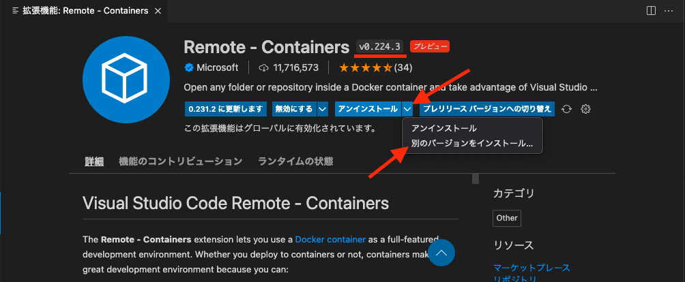

# 開発環境構築(docker-compose.dev.yml)

## 必要アプリケーション

下記のアプリケーションが必要になる。

- [Visual Studio Code](https://azure.microsoft.com/ja-jp/products/visual-studio-code/)

[Remote - Containers - Visual Studio Marketplace](https://marketplace.visualstudio.com/items?itemName=ms-vscode-remote.remote-containers)

- [Docker](https://www.docker.com/products/docker-desktop)

Docker Desktop > Preferences > General > Use Docker Compose V2 　をチェック

### mac の場合

Mac を使用している場合は brew cask を使用してインストールすると良い

[macOS（または Linux）用パッケージマネージャー — Homebrew](https://brew.sh/index_ja)

```
brew install --cask docker
brew install --cask visual-studio-code
```

下記をわすれずに

[Remote - Containers - Visual Studio Marketplace](https://marketplace.visualstudio.com/items?itemName=ms-vscode-remote.remote-containers)

### その他の OS

windwos と linux 環境での docker のインストール方法は [docker のインストール](./dockerのインストール.md)にある

## 必要ソースのクローンとディレクトリ構成

1. コードの clone

coias を任意のディレクトリに展開する

```
curl -sf https://raw.githubusercontent.com/coias/coias-docker-compose/main/code-clone | sh -s
```

```
coias-docker-compose        <-- clone
├── web-coias-back-app          <-- clone
├── web-coias-front-app         <-- clone
├── web-coias-front-page          <-- clone
├── docker-compose.dev.yml
└── READEME.md
```

## 手順

ここでは開発環境の構築について解説します。

### コンテナに接続

Remote Containers(vscode 拡張機能)に docker-compose を読み込ませて、docker を起動します。

      1. vscodeの左下にある緑色のリモートウインドウを開きます。
      2. Open Folder in Container ...
      3. 「web-coias-front-app」フォルダーを選択
      4. vscodeを別ウインドウで開き操作を繰り返す
      5. 「web-coias-back-app」フォルダーを選択

## 接続できないときは

実行用コンテナと開発用コンテナの名前が同じため、どちらも保存するということができません。
その他 Docker の不具合の可能性もありますので、下記をお試しください。

1. Docker Desktop よりコンテナ、イメージの削除
2. Docker Network の削除
3. Docker のリスタート

**参考**

- [docker container](https://docs.docker.com/engine/reference/commandline/container/)
- [docker image](https://docs.docker.com/engine/reference/commandline/image/)
- [docker network](https://docs.docker.com/engine/reference/commandline/network/)
- [Explore Containers](https://docs.docker.com/desktop/use-desktop/container/)
- [Explore Images](https://docs.docker.com/desktop/use-desktop/images/)

```bash
# コンテナの削除(DesktopでGUI操作も可)
docker container ls
docker container rm コンテナID

# イメージの削除(DesktopでGUI操作も可)
docker image ls
docker image rm イメージID

# networkの削除
docker network ls
docker network rm ネットワークID
```

## デバック

coias-back-app では vscode の「実行とデバック」から FastAPI の起動とデバックができる。  
coias-front-app では vscode の「実行とデバック」から nodejs の起動とデバックできる。

### 参考

[Get started with development Containers in Visual Studio Code](https://code.visualstudio.com/docs/remote/containers-tutorial)

[既存の Docker 開発環境を VS Code の Remote Development で開発できるようにしてみた | DevelopersIO](https://dev.classmethod.jp/articles/add-vs-code-remote-development-settings-to-existing-docker-environment/)

## bug

2022/4/5
~Remote - Container 　最新版　 0.232.3 　にて開発コンテナが開かないバグが発生している。  
対象方法としては、パッケージのダウングレードしかない。~



2022/5/12
上記問題に対して修正パッチが配布済み
https://github.com/microsoft/vscode-remote-release/issues/6556
