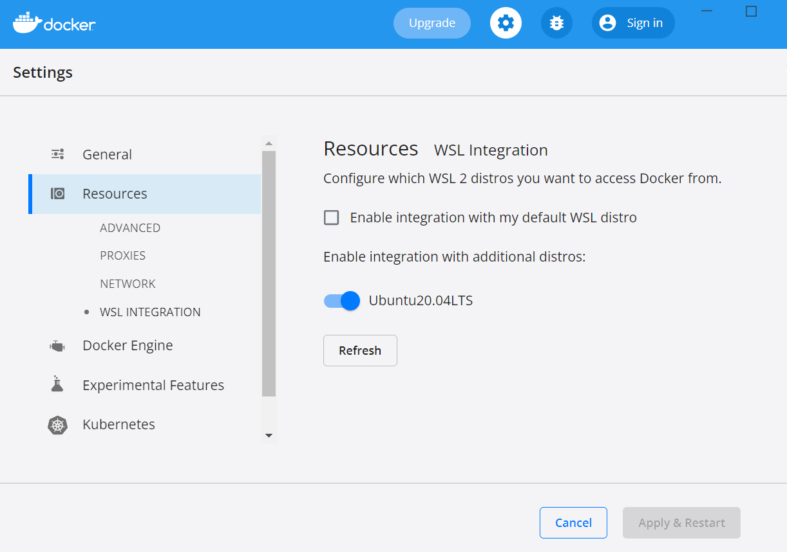
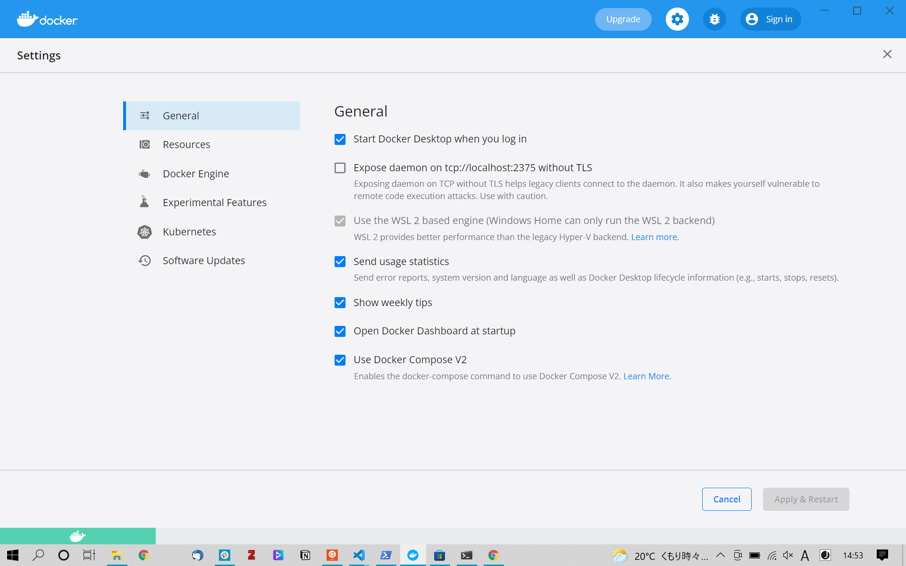
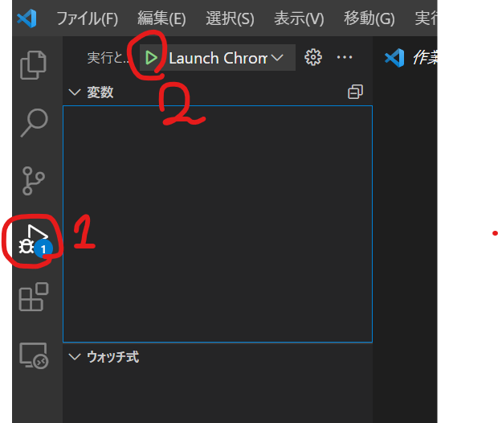

# WindowsにおけるWSLとDocker Desktopのインストール

## WSLのインストール
### WSLの有効化

コントロールパネル -> システムとセキュリティ -> プログラム -> プログラムと機能「Windowsの機能の有効化または無効化」を開く。

「Linux用Windowsサブシステム」「仮想マシンプラットフォーム」にチェックを入れ、OSを再起動。

WSL2の有効化

Power Shell で次のコマンドを打つ：`wsl --set-defaul-version 2`

### WSLのインストール

Microsoft store で「wsl」で検索、適当なもの（例：Ubuntu20.04LTS）をインストール

### カーネルコンポーネントの更新

https://aka.ms/wsl2kernel にアクセス

「wsl_update_x64.msi」をダウンロード、実行し、インストール。

Power Shell で次のコマンドを打つ：`wsl --set-version Ubuntu20.04LTS 2`  
 ※「Ubuntu20.04LTS」の部分はインストールしたディストリビューションに応じて適宜変更する。ディストリビューション名は`wsl -l -v`で確認できる。

### WSL2になっていることの確認
Power Shell で `wsl -l -v` 当該ディストリビューションのVERSION の列が「2」となっていればOK.

## dockerのインストール

下記リンクからインストール  
 https://www.docker.com/products/docker-desktop


### dockerの設定

以下の図のような状態にする。





## VScodeのインストール
下記リンクからインストール

https://azure.microsoft.com/ja-jp/products/visual-studio-code/

### COIASの実行

coias アプリケーションのクローン

WSLで以下コマンドを実行  
```curl -sfhttps://raw.githubusercontent.com/coias/coias-docker-compose/main/code-clone | sh -s```

フロントエンド「coias-front-app」
バックエンド「coias-back-app」のコード群がVScodeで開かれる

### docker コンテナで開く

1. VScode で、左下の緑色の部分をクリックする
2. 「Reopen in Container」をクリックする。


### 実行する

1. VScodeで「実行とデバッグ」タブを開く
2. 再生ボタンを押して実行する。

上記の作業を「coias-front-app」「coias-back-app」それぞれに対して行う。



ブラウザが立ち上がり、COIASが起動する。